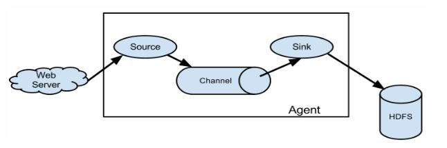

----------

[toc?depth=3]

## 一、Flume的介绍

### 1.1什么是Flume

		可以理解flume是日志收集系统，Flume是Cloudera提供的一个高可用的，高可靠的，分布式的海量日志采集、聚合和传输的系统，Flume支持在日志系统中定制各类数据发送方，用于收集数据；同时，Flume提供对数据进行简单处理，并写到各种数据接受方（可定制）的能力。
       当前Flume有两个版本Flume 0.9X版本的统称Flume-og，Flume1.X版本的统称Flume-ng。由于Flume-ng经过重大重构，与Flume-og有很大不同，使用时请注意区分，经过架构重构后，Flume NG更像是一个轻量级的小工具，适应各种方式的日志收集，并支持failover和负载均衡。改动的另一原因是将 Flume 纳入 apache 旗下，cloudera Flume 改名为 Apache Flume。
      Apache Flume是一个分布式，可靠且可用的系统，用于高效地收集，汇总和将来自多个不同源的大量日志数据移动到集中式数据存储区。Apache Flume的使用不仅限于日志数据聚合。 由于数据源是可定制的，Flume可用于传输大量的事件数据，包括但不限于网络流量数据，社交媒体生成的数据，电子邮件消息以及几乎所有可能的数据源。Apache Flume是Apache软件基金会的顶级项目。

### 1.2Flume的结构

 - 数据流模型

		Flume事件被定义为具有字节有效载荷和一组可选字符串属性的数据流单元。 Flume代理是一个（JVM）进程，它承载事件从外部源流向下一个目标（跳）的组件。Flume以agent为最小的独立运行单位。一个agent就是一个JVM。单agent由Source、Sink和Channel三大组件构成。
		